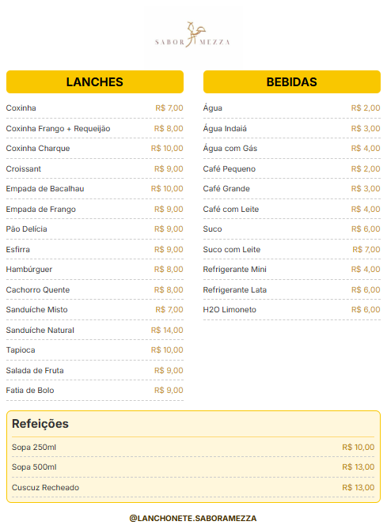

# 📱 Cardápio Digital – Lanchonete Sabor a Mezza

Bem-vindo ao repositório do **Cardápio Digital da Lanchonete Sabor a Mezza**!  
Este projeto tem como objetivo modernizar o atendimento da lanchonete, oferecendo aos clientes uma maneira prática de visualizar o cardápio através de um **QR code**, enquanto o administrador pode **gerenciar os itens do cardápio** de forma simples e segura por meio de um painel exclusivo.

🌐 **Acesse o cardápio online:**  [Menu](https://projeto-menu-xi.vercel.app/)

---

## 👥 Participantes

- Henri Leonardo
- Gabriel Pereira
- Gabriel Vera Cruz
- Guilherme Serreti
- Luiz Eduardo Oliveira
- Igor Leal

---

## 📌 Links Importantes

- 📋 **Backlog no Trello:** [Acessar Trello](https://trello.com/invite/b/6807e89191cba0906afc21f5/ATTI8e254b05ecb2bb91307443cad7dcc508D2C13218/projeto-aps)
- 🎨 **Protótipo no Figma:** [Acessar Figma](https://www.figma.com/design/fqoD4zycqm822DsThk4hmY/Lanchonete-Abner?node-id=0-1&p=f&t=QAm4ceR15xu9nmwI-0)
- 🎥 **Apresentação (Screencast):** [Ver vídeo no YouTube](https://youtu.be/HPyJrhCvtDk)
- 📍 **Diagrama de atividades do sistema:** [Ver diagrama](https://lucid.app/lucidchart/e6580c26-daf6-4259-97f9-1dbdb381973f/edit?invitationId=inv_76da1395-38d8-480e-a17b-e21db8b3b665&page=0_0#)

---

## 📖 Descrição

O sistema oferece duas áreas principais:

- **Visualização do cardápio (Cliente):** acessível via QR code, com exibição clara dos produtos disponíveis.
- **Painel administrativo (Administrador):** interface segura para adicionar, editar, remover ou desativar itens do cardápio.

---

## 🎯 Público-alvo

Clientes da Lanchonete do Abner, situada na Rua das Flores, 123 – Centro.  
Ideal para pequenos comércios que desejam oferecer um atendimento moderno e digital.

---

## 🖥 Funcionalidades

### Cliente

- Acesso ao cardápio escaneando um QR code.
- Visualização dos itens com nome, descrição, preço.
- Navegação por categorias (lanches, bebidas, sobremesas etc.).
- Indicação de itens indisponíveis.

### Administrador

- Login para acesso seguro ao painel administrativo.
- Adição de novos produtos ao cardápio.
- Edição de informações dos itens (nome, descrição, preço).
- Remoção ou desativação temporária de itens.
- Organização dos produtos por categoria.

---

## ✍ Histórias de Usuário

1. Como cliente, quero visualizar os itens do cardápio para saber o que está disponível na lanchonete.
2. Como cliente, quero ver a descrição e o preço de cada item para escolher com mais segurança.
3. Como cliente, quero acessar o cardápio escaneando um QR code para facilitar o acesso pelo celular.
4. Como cliente, quero visualizar categorias separadas (ex: lanches, bebidas, sobremesas) para encontrar os produtos mais facilmente.
5. Como cliente, quero saber se um item está indisponível para não perder tempo escolhendo algo que não posso pedir.
6. Como administrador, quero adicionar novos itens ao cardápio para manter o menu sempre atualizado.
7. Como administrador, quero editar as informações de um item (nome, descrição, preço) para corrigir ou atualizar dados.
8. Como administrador, quero remover itens do cardápio quando não estiverem mais disponíveis.
9. Como administrador, quero acessar o painel de administração com login e senha para garantir a segurança das edições.
10. Como administrador, quero ativar ou desativar um item do cardápio para controlar a disponibilidade sem excluir o item.

---

## 📝 Requisitos

### Requisitos Funcionais

- Visualização de cardápio por QR code.
- Login de administrador.
- Cadastro, edição e exclusão de itens.
- Classificação por categoria.
- Indicação de disponibilidade.

### Requisitos Não Funcionais

- Interface responsiva (mobile e desktop).
- Navegação simples e intuitiva.
- Rápido carregamento de páginas.
- Design alinhado com o protótipo do Figma.
- Hospedagem estável (ex: Vercel).

---

## 🚀 Tecnologias Utilizadas

- HTML5
- CSS3
- JavaScript (ES6+)
- LocalStorage (persistência de dados)

---

## 🛠 Estrutura do Projeto

- `index.html`: Menu
- `index.css`: Estilo das página
- `logonome.jng`: Imagem da logo

---

## 📸 Páginas Desenvolvidas

## Qrcode

  

## Menu

  

---

## Issue / bug tracker
  No começo, foi encontrada uma dificuldade na primeira versão do projeto, no que se diz a exibição e edição do cardápio online. Foi utilizado a tecnologia de localStorage, que mais tarde se tornou ineficiente de acordo com o proposto do projeto, já que é proposto a manipulação direta do menu que é público, visto que o localStorage só interfere na máquina local.

## Evidência de programação em pares

## ✅ Status do Projeto

📌 Em desenvolvimento — funcionalidades principais em andamento.
